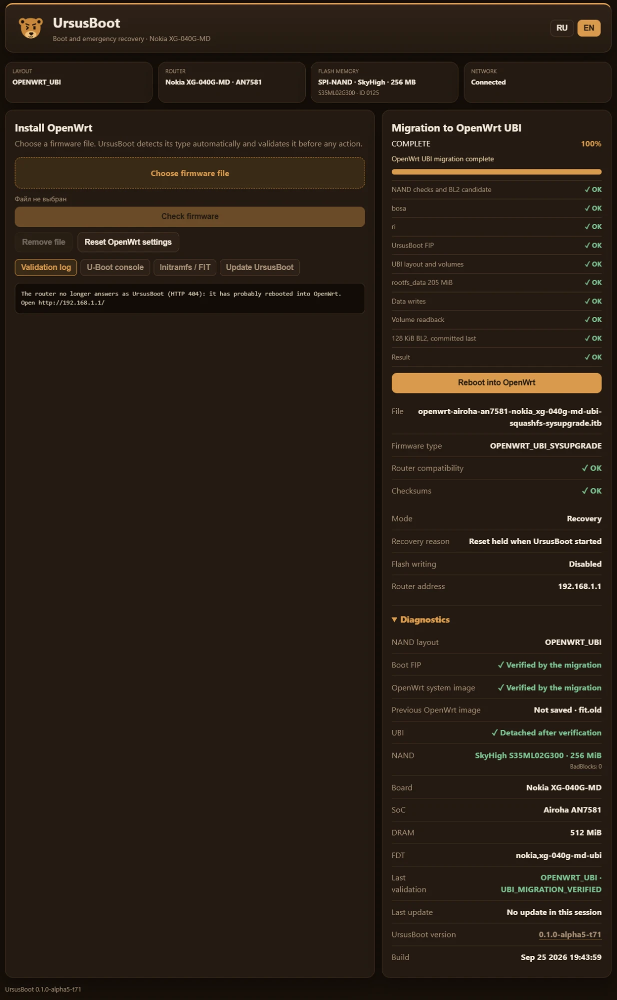

# UrsusBoot

Версия на английском: README.md

Компактный U-Boot для установки OpenWrt и восстановления роутеров на платформе Airoha.

UrsusBoot адаптирует наработки экосистемы OpenWrt для устройств Airoha, где критически важно иметь компактную и всегда доступную среду восстановления. Загрузчик включает в себя веб-интерфейс WebFailsafe, механизмы проверки прошивок, инструменты миграции на UBI и утилиты восстановления, помещаясь при этом в загрузочный раздел крайне ограниченного объема.

### Зачем нужен UrsusBoot

Главное преимущество: UrsusBoot предоставляет функциональность полноценной среды восстановления, занимая при этом раздел размером всего около 512 КБ. Для проверки образов, изменения разметки памяти и установки OpenWrt больше не требуются загрузка ядра Linux и полноценная ОС.

**Ключевые возможности:**

- встроенный веб-интерфейс восстановления (WebFailsafe);
- распознавание и строгая валидация образов OpenWrt (sysupgrade / FIT);
- поддержка работы с заводской разметкой, OpenWrt поверх заводской разметки и чистой UBI-разметкой;
- формирование томов UBI и миграция на эту файловую систему;
- безопасное обновление контейнера FIP и самого загрузчика;
- верификация записанных данных (контрольное чтение) с прерыванием операции при малейших ошибках;
- восстановление по сети, а также через UART и Airoha BootROM.

### Что такое UrsusBoot на самом деле

UrsusBoot — это не написанный с нуля «самодельный» загрузчик. В его основе лежит стандартный U-Boot 2026.07, применяемый в OpenWrt для платформ Airoha, дополненный специфичными для платформы патчами. Из конфигурации убрано всё лишнее, а поверх базовых функций добавлен инструментарий для восстановления. Структура и синтаксис полностью привычны для тех, кто уже работал с U-Boot.

Ничего критически важного для Airoha не удалено. В сборку включены 65 стандартных команд U-Boot:

- полный стек MTD/UBI и средства работы с переменными окружения;
- сетевой стек: `ping`, `tftpboot`, `wget`, `dhcp`, `dns`, `sntp`, `mii`, `mdio`;
- команды загрузки: `bootm`, `booti`, `bootflow`, `bootd`, `go`, `elf`;
- работа с разделами: `part`, `gpt`;
- криптография и архивация: хеширование, CRC, распаковка LZMA/LZ4/gzip;
- низкоуровневая периферия: управление GPIO, pinmux, светодиодами, кнопками и SMC.

К этому набору добавлены 7 специфичных команд UrsusBoot. В итоге полнофункциональная открытая консоль загрузчика предоставляет 72 команды.

Для экономии места было отключено всё, что UrsusBoot не использует (95 групп команд и их подсистемы):

- все высокоуровневые файловые системы (ext4, FAT, btrfs, squashfs, erofs, UBIFS, exFAT, cramfs, ZFS);
- неиспользуемые в UrsusBoot подсистемы накопителей и шин (USB, MMC/SD, SATA, SCSI, NVMe, PCI, IDE, SPI-флешки, OneNAND). USB физически присутствует на плате, но USB-стек загрузчику не нужен и исключён ради экономии места;
- поддержка EFI, вывод видео, подсистемы bootmenu/bootstd/bootmeth;
- модули TPM, I2C, ADC, DFU, fuse, pstore, а также тестовые и демонстрационные утилиты.

Проверка RSA-подписей (`FIT_SIGNATURE`) также отключена: загрузчик сверяет только хеши FIT-образов.

Именно так достигается компактность. Чтобы уложиться примерно в 512 КБ, мы не стали писать загрузчик заново, а просто безжалостно вырезали из оригинального U-Boot всё лишнее для конкретного «железа».

**Что UrsusBoot действительно добавляет к штатному U-Boot:**

- **WebFailsafe:** веб-интерфейс с полноценной браузерной консолью U-Boot, выполняющей реальные команды, а не урезанный набор синонимов.
- **Безопасная работа с OpenWrt:** загрузка прошивок в оперативную память и их строгая валидация (sysupgrade/FIT) *до* начала записи во флеш-память.
- **Управление UBI:** создание, обновление и конвертация разметки UBI с обязательным контрольным чтением после записи и детальной диагностикой кодов ошибок.
- **Умный диспетчер загрузки:** скрипт автоматически выбирает метод запуска, исходя из фактического содержимого NAND, а при сбое переходит в режим восстановления (а не зависает в мертвой консоли).
- **Автономность:** функции обновления собственного FIP-контейнера и низкоуровневого восстановления через UART и Airoha BootROM.

### Принцип самодостаточности репозитория

Проект спроектирован полностью автономным. В процессе штатной сборки скрипты не скачивают сторонний код, шаблоны или бинарные файлы из других репозиториев.

Единственная внешняя зависимость — официальный OpenWrt SDK (или набор тулчейнов OpenWrt для AArch64). На сборочной машине также потребуется компилятор C и заголовочные файлы `liblzma` для компиляции упаковщика BL33 (формат LZMA1EXT/no-EOPM). Все патчи, конфигурации, сборочные скрипты, эталонные FIP-контейнеры и шаблоны плат уже лежат в этом репозитории.

Шаблоны для Nokia XG-040G-MD и XG-040G-MF представляют собой дампы заводских загрузочных разделов размером 512 КБ. В них нет индивидуальных данных конкретного устройства: MAC-адреса, серийные номера, параметры GPON и прочая специфика хранятся отдельно (в разделах RI/BOSA) и обрабатываются соответствующими механизмами.

### Дамп заводского mtd0 не требуется

Для поддерживаемых плат больше не нужно предварительно снимать дамп раздела `mtd0` перед установкой.

```
заводской шаблон платы + FIP-контейнер UrsusBoot
                 |
                 v
готовый образ mtd0 (512 КБ) для прошивки
```

Пример:

```
OPENWRT_SDK=/path/to/openwrt-sdk ./build.sh xg040-md persistent
```

В результате в каталоге `dist/xg040-md/` будут созданы:

- `u-boot.bin`
- `u-boot.lzma`
- заново перепакованный `ursusboot-update.fip`
- `ursusboot-install-mtd0.bin`

Эталонный FIP-образ гарантирует сохранение правильной платформенной структуры контейнера. Его раздел BL33 заменяется свежесобранным U-Boot, после чего выполняется побайтовая проверка перед генерацией итогового установочного образа.

Если устройство полностью «окирпичено», этот же шаблон применяется для восстановления через UART или Airoha BootROM. Если заводская прошивка Nokia еще загружается, десктопная утилита UrsusFlasher может прошить образ через root-доступ и выполнить контрольное чтение для верификации. Индивидуальные параметры устройства при необходимости восстанавливаются из штатных разделов, бэкапа или вбиваются вручную с наклейки на корпусе.

### Структура репозитория

- `build.sh` — главная точка входа для сборки.
- `scripts/` — вспомогательные скрипты для сборки и автоматического тестирования (QA).
- `config/` — фрагменты Kconfig, полные конфигурации и профили поддерживаемых плат.
- `boards/` — параметры плат и заводские шаблоны загрузочной области (512 КБ).
- `reference/` — проверенные эталонные FIP-контейнеры для перепаковки BL33.
- `src/u-boot/` — полное дерево исходников U-Boot 2026.07 с патчами UrsusBoot.
- `dist/` — каталог с результатами сборки (игнорируется Git).

Изменения в коде U-Boot (внутри `src/u-boot/`) минимальны и строго локализованы:

- `cmd/ursusdispatch.c` — логика диспетчера загрузки.
- `cmd/ursusweb.c` — HTTP-сервер WebFailsafe, загрузка и валидация образов в RAM.
- `cmd/ursusubi.c` — механизмы работы с UBI.
- `cmd/ursusupdate.c` — логика проверки и обновления FIP (загрузчика).
- `cmd/ursusstock.c` — запуск заводской прошивки через механизм StockBridge.
- `cmd/ursusled.c` — управление светодиодами LAN и системными индикаторами.
- `include/ursusweb_ui.inc` — статика веб-интерфейса (HTML/CSS/JS, упакованные в строку C).
- `include/ursus_*.h` — общие заголовочные файлы.
- `include/ursus_logo.inc` — встроенный логотип и favicon.
- `drivers/gpio/ursus_an7581_safe_gpio.c` — безопасный драйвер GPIO.
- `defenvs/` — дефолтные переменные окружения для каждой платы.

### Связь с UrsusFlasher и "ванильным" U-Boot

- **airoha-ursusboot** (данный репозиторий) — исходный код самого загрузчика UrsusBoot. Здесь хранятся релизы начиная с TEST63, профили плат MD/MF, исходники BL2 с функцией быстрого сканирования UBI, предзагрузчик и скомпилированные бинарники.
- **airoha-router-ursusflasher** — десктопная утилита-прошивальщик. Она берет на себя создание бэкапов, работу с интерфейсами подключения, безопасную запись во флеш-память, верификацию, диагностику и установку OpenWrt (режимы ONECLICK/EXPERT).
  - Она жестко привязана к конкретному коммиту данного репозитория.
  - Бинарники для плат MD и MF должны быть собраны из одного и того же коммита, иначе сборка дистрибутива прошивальщика прерывается.
- **Vanilla U-Boot** — параллельная ветка проекта: стандартный U-Boot от OpenWrt для работы с финальной UBI-разметкой. Данный репозиторий его сборкой не занимается.

### Всё в BL33

UrsusBoot целиком живёт в BL33 (U-Boot proper) — без recovery-ядра, initramfs и отдельного раздела. На заводской разметке Nokia он встаёт в штатное окно загрузчика mtd0 `0x800..0x7BFFF`: ROM prefix перед ним и окружение Nokia на `0x7C000` не трогаются, родной BL2 остаётся на месте. В этом окне (сжатый BL33 около 300 КиБ) помещаются:

- сеть lwIP и HTTP-сервер WebFailsafe с приёмом многомегабайтных образов в RAM;
- самодостаточная страница RU/EN без внешних ресурсов и настоящая консоль U-Boot в браузере;
- проверка FIT (хеши, плата, класс образа) и FIP до любой записи, с кодами причин отказа;
- миграция Nokia STOCK → OpenWrt UBI с переносом `bosa`/`ri`, контрольным чтением и BL2 последним;
- транзакционное обновление загрузчика (`fip.new` → проверка → атомарная замена, откат) и ремонт отсутствующего/битого `fip`;
- журнал операций, диагностика NAND, Reset-латч и световые паттерны.

Восстановление поэтому не зависит ни от ядра, ни от rootfs, ни от содержимого UBI и стартует за секунды. Запас окна проверяется в CI при каждой сборке (`scripts/ci/check_bl33_budget.py`); на t71 занято около 91% у MD и около 97% у MF, так что каждая новая функция — на счету.

### Место среди других WebFailsafe-загрузчиков

Идея веб-восстановления в загрузчике принадлежит сообществу: **hanwckf** (`bl-mt798x`) и **Yuzhii0718** (продолжение, в том числе TF-A для Airoha), а для Airoha AN7581/AN7583 есть и сборка U-Boot с веб-восстановлением на их основе. Они поддерживают десятки плат и обкатаны огромным числом пользователей — UrsusBoot на это не претендует.

Своё UrsusBoot добавляет в другом: работа внутри заводской цепочки Nokia без замены BL2, миграция разметки самим загрузчиком с сохранением заводских данных, транзакционная запись с откатом, восстановление, которое нельзя отключить окружением, воспроизводимая сборка с `PROVENANCE.json`, и инструменты вокруг — UrsusFlasher и UrsidoRescue, — которые ведут роутер от заводской прошивки до OpenWrt и обратно с полным бэкапом до первой записи. Честная цена — две поддерживаемые модели и статус alpha.

### Документация

Этот файл содержит лишь общую архитектуру проекта. Подробная техническая документация (на английском языке) находится в каталоге `docs/`:

- `BUILDING.md` — требования к сборочному окружению, профили плат, механизм упаковки FIP и структура артефактов.
- `INSTALLING.md` — инструкция по работе с UrsusFlasher, получению root-доступа в заводской прошивке, а также по восстановлению через UART/BootROM.
- `TESTING.md` — критерии тестирования аппаратной и программной частей (QA), включая проверку MAC-адресов и сетевых интерфейсов.
- `PORTING.md` — руководство по портированию загрузчика на новые платы: архитектура, профили, границы ответственности.
- `PROVENANCE.md` — цепочка происхождения исходников, бинарных блобов и FIP-контейнеров.
- `CREDITS.md` — благодарности авторам оригинальных проектов и сообществу.
- `CHANGELOG.md` — история изменений, релизов и аппаратных ревизий.

### Скрипты сборки и проверки

|Скрипт|Назначение|
|---|---|
|`build.sh`|Компилирует U-Boot под выбранную плату, упаковывает BL33 в эталонный FIP и генерирует готовый к прошивке образ `mtd0`.|
|`src/u-boot/repack_persistent_fip.py`|Заменяет раздел BL33 в эталонном FIP-контейнере на свежесобранный U-Boot, сохраняя оригинальную структуру Airoha.|
|`src/u-boot/lzma1ext_noeopm.c`|Упаковщик формата LZMA1EXT/no-EOPM, формирующий образ BL33 в виде, понятном платформе Airoha.|
|`scripts/make-install-mtd0.py`|Склеивает 512-килобайтный шаблон загрузочной области с перепакованным FIP-контейнером, создавая финальный `mtd0`.|
|`scripts/ci/build-release.sh`|Скрипт полного цикла сборки (используется в CI и UrsusFlasher): собирает BL2 с быстрым сканированием UBI → FIP-предзагрузчик → целевой UrsusBoot → упаковка → генерация `PROVENANCE.json`.|
|`scripts/pin_ubi_preloader.py`|Вшивает в исходники UrsusBoot контрольную сумму SHA256 выбранного UBI-предзагрузчика и 128-килобайтного образа BL2 (`URSUS_UBI_PRELOADER`).|
|`scripts/atf/`|Патчи ускоренного сканирования UBI для ATF, интеграция их в среду Build/Prepare OpenWrt и логика упаковки BL2.|
|`scripts/mf/`|Логика адаптации исходников и перепаковка FIP под плату XG-040G-MF (на базе контейнера из MedveFlasher).|
|`scripts/qa.sh`|Скрипт самодиагностики. Выполняет побайтовое сравнение шаблонов и эталонных FIP, валидирует `board-profiles.json`, компилирует утилиты на Python и проверяет целостность всего проекта.|
|`scripts/resolve_board_profile.py`|Читает параметры платы из `config/board-profiles.json`.|
|`scripts/apply_kconfig_fragment.py`|Интегрирует конфигурационный фрагмент `.cfg` в основной `.config`.|
|`scripts/apply_board_policy.py`|Применяет политики и ограничения конкретной платы к дереву исходников.|
|`scripts/apply_runtime_role.py`|Переключает дефолтные переменные окружения между режимами `persistent` и `ram-recovery`.|

**Сборка:**

```
OPENWRT_SDK=/path/to/openwrt-sdk ./build.sh xg040-md
URSUS_FIP_DONOR=reference/md/ursusboot-test61-update.fip \
  OPENWRT_SDK=/path/to/openwrt-sdk ./build.sh xg040-md
OPENWRT_SDK=/path/to/openwrt-sdk ./build.sh xg040-md ram-recovery
```

Переменная `OPENWRT_SDK` (её также можно передать третьим аргументом) должна указывать на путь к распакованному OpenWrt SDK или AArch64-тулчейну. Скрипт сам найдет кросс-компилятор. Артефакты сборки сохраняются в каталог `dist/<плата>/`.

Параметры плат, пути к шаблонам и профили режимов считываются из `config/board-profiles.json` — внутри `build.sh` нет жестко зашитых конфигураций. Скрипт прервёт работу, если:

- указана неизвестная плата;
- указана неизвестная роль (режим);
- выбранный режим не поддерживается конкретной платой.

Если плата описана в JSON, но её конфигурация еще не создана, `build.sh` выдаст понятное текстовое предупреждение, а не упадет с нечитаемой ошибкой компиляции.

### Роль эталонного FIP-контейнера

Сборочный скрипт не просто копирует FIP-контейнер «как есть». Используется эталонный образ, из которого извлекается гарантированно рабочая структура Airoha:

- BL31 и прочие системные записи FIP;
- правильный порядок и разметка блоков;
- корректные сертификаты и контрольные суммы;
- жесткие лимиты контейнера под конкретную плату.

Новый `u-boot.bin` сжимается в формат LZMA1EXT/no-EOPM, после чего им точечно заменяется секция `NT_FW/BL33` внутри эталонного FIP.

```
эталонный FIP-контейнер
        +
свежий u-boot.bin из текущих исходников
        |
        v
сжатие в формат LZMA1EXT/no-EOPM BL33
        |
        v
перепаковка контейнера (заменяется только NT_FW/BL33)
        |
        v
dist/<плата>/ursusboot-update.fip
```

Указать собственный эталонный FIP можно через переменные:

```
URSUS_FIP_DONOR=/path/to/proven-donor.fip \
  OPENWRT_SDK=/path/to/openwrt-sdk ./build.sh xg040-md persistent
```

|Переменная|Значение|
|---|---|
|`URSUS_FIP_DONOR`|Главная переменная. Переопределяет эталонный контейнер `reference_fip`, указанный в профиле платы.|
|`URSUS_FIP_TEMPLATE`|Синоним `URSUS_FIP_DONOR` (работает аналогично).|
|`URSUS_FIP`|Устаревший синоним (сохранен для обратной совместимости). Указывает на FIP, который используется как основа, а не просто копируется.|

Если переменные не заданы, скрипт берет `reference_fip` из профиля платы. Итоговый файл `ursusboot-update.fip` проходит жесткую проверку: распакованный из него раздел NT_FW/BL33 должен побайтово совпадать с файлом `u-boot.lzma` из текущей сборки. Только после этого генерируется установочный 512-КБ образ.

Для артефактов каждой сборки генерируется свой файл `dist/<плата>/SHA256SUMS`. Общего файла хешей в корне проекта нет умышленно: Git сам по себе гарантирует целостность исходников, а ручное обновление монолитного списка хешей — бессмысленная рутина.

Режим работы загрузчика задаётся на уровне исходного кода перед компиляцией (например, для `ram-recovery` меняется параметр `bootcmd`). При этом исходное дерево `src/u-boot` остается нетронутым: сборка идет в изолированной копии `work/<плата>-<роль>/u-boot`. Это позволяет собирать разные профили подряд из одного репозитория. Полная логика подготовки исходников описана в `docs/BUILDING.md`.

### Режимы работы

|Режим|Параметр bootcmd|Назначение|
|---|---|---|
|`persistent`|`ursusdispatch`|Стандартная загрузка системы из флеш-памяти под управлением встроенного диспетчера.|
|`ram-recovery`|`ursusweb;true`|Аварийный WebFailsafe. Запускается исключительно в оперативной памяти (минуя NAND), сразу поднимает веб-интерфейс.|

### Установка и обновление

Рекомендуемый метод прошивки свежего `ursusboot-update.fip` — десктопная утилита UrsusFlasher (доступна для Windows и Linux). Она автоматизирует безопасное подключение, запись и верификацию.

Утилита сама выбирает оптимальный метод из доступных:

- **Через веб-интерфейс WebFailsafe:** образ заливается через HTTP, роутер проверяет его, шьет и выполняет контрольное чтение.
- **Из-под работающей заводской прошивки Nokia (root):** образ передается в Linux роутера, проверяется, записывается подходящей утилитой MTD, после чего верифицируется чтением.
- **Через UART / Airoha BootROM (Brick Mode):** восстановление по последовательному порту, если роутер полностью мертв и веб-интерфейс недоступен.

UrsusFlasher можно использовать и для прошивки локальных сборок при портировании на новые платы. То есть: вы компилируете FIP в этом репозитории, а опасные низкоуровневые операции доверяете Флешеру.

Ручные инструкции ниже предназначены исключительно для аварийных ситуаций и опытных пользователей.

#### Способ А — из-под заводского Linux (командная строка, root)

Перед прошивкой убедитесь, что соблюдены все условия:

```
cat /proc/mtd
# mtd0 должен быть разделом загрузчика: size 00080000, erase 00020000

cat /sys/class/mtd/mtd0/bad_blocks
# значение должно быть равно 0

command -v dd sha256sum
```

Обязательно сделайте дамп всего загрузочного раздела (512 КБ):

```
dd if=/dev/mtd0 bs=131072 count=4 of=/tmp/mtd0-backup.bin
sha256sum /tmp/mtd0-backup.bin
```

**Важно:** Файл в каталоге `/tmp` — это еще не бэкап. Обязательно скопируйте его на ПК и сверьте SHA256-хеш.

Закачав `ursusboot-install-mtd0.bin` обратно на роутер, сверьте его хеш перед записью. Для прошивки используйте только **один** из вариантов ниже. Если процесс начался, не прерывайте его и не пытайтесь запустить другую команду — раздел мог быть уже стерт.

```
mtd write /tmp/ursusboot-mtd0.bin bootloader

# или
flash_erase /dev/mtd0 0 0 && nandwrite -p /dev/mtd0 /tmp/ursusboot-mtd0.bin

# или
flash_eraseall /dev/mtd0 && nandwrite -p /dev/mtd0 /tmp/ursusboot-mtd0.bin

# или
mtd_debug erase /dev/mtd0 0 0x80000 && \
mtd_debug write /dev/mtd0 0 0x80000 /tmp/ursusboot-mtd0.bin

sync
```

Перед перезагрузкой прочитайте блок из памяти и сравните хеш:

```
dd if=/dev/mtd0 bs=131072 count=4 2>/dev/null | sha256sum
```

**Критично:** Если хеши после чтения не совпали, **НИ В КОЕМ СЛУЧАЕ НЕ ВЫКЛЮЧАЙТЕ ПИТАНИЕ**. Пока система работает в памяти, у вас есть шанс перезаписать раздел.

*Примечание: в OpenWrt раздел загрузчика часто смонтирован в режиме read-only. UrsusFlasher умеет обходить это с помощью модуля `mtd-rw` и кастомной утилиты `ursus-mtd-raw`.*

#### Способ B — UART / XMODEM

Используйте USB-UART адаптер с логикой 3.3В (контакты TX/RX/GND). Параметры порта: 115200 8N1, аппаратное управление потоком отключено.

Если консоль U-Boot доступна:

```
mtd list
loadx 0x8e000000
# отправьте файл ursusboot-install-mtd0.bin по протоколу XMODEM

mtd erase bl2 0x0 0x80000
mtd write bl2 0x8e000000 0x0 0x80000
```

Название раздела зависит от текущей разметки памяти (на стоке это обычно `bl2`, в среде UrsusBoot/OpenWrt может быть `ursus-ubi-bl2`). **Всегда ориентируйтесь на вывод команды `mtd list`, угадывать имя раздела нельзя!**

Если роутер вообще не подает признаков жизни, используйте Airoha BootROM:

1. Обесточьте устройство.
2. Зажмите кнопку Reset и подайте питание.
3. Залейте проверенный образ предзагрузчика (BL2) по протоколу XMODEM.
4. Залейте FIP-образ RAM-установщика по XMODEM.
5. Работайте в консоли U-Boot (он загружен в оперативную память, NAND пока не затронут).

*Для платформы MD успешно протестирован RAM-установщик версии `alpha3` (именно его использует UrsusFlasher). Обратите внимание: хотя в режиме `ram-recovery` параметр загрузки установлен в `ursusweb;true`, это само по себе не гарантирует запуск любого перепакованного FIP на втором этапе BootROM. Пока структура контейнера не отлажена, используйте для аварийного восстановления только проверенный RAM-установщик из комплекта UrsusFlasher.*

После успешной загрузки UrsusBoot в RAM, прошивка постоянного загрузчика во флеш выполняется через WebFailsafe (или UrsusFlasher) в штатном режиме с проверкой чтения.

### Встроенные команды UrsusBoot

Специфичные утилиты UrsusBoot работают как обычные команды консоли U-Boot: их можно вызывать из переменных окружения или набирать вручную через UART.

|Команда|Аргументы|Назначение|
|---|---|---|
|`ursusdispatch`|—|Основной диспетчер загрузки (подробности ниже).|
|`ursusweb`|—|Запуск WebFailsafe: поднимает сеть (lwIP), веб-сервер на 192.168.1.1:80 и параллельно отдает логи в консоль UART. Защищена от повторного запуска (`URSUS_WEB_ALREADY_RUNNING`).|
|`ursusubiboot`|—|Запуск OpenWrt из UBI-тома `fit`.|
|`ursusstockboot`|`[master\|slave]`|Загрузка заводской прошивки через StockBridge (передает ядру те же параметры платы, что и оригинальный Nokia tcboot).|
|`ursusupdate`|`check\|write <адрес> <размер>`|Валидация и прошивка FIP-контейнера UrsusBoot, загруженного в оперативную память.|
|`ursussettings`|`reset`|Безопасный сброс настроек (форматируется только раздел `rootfs_data` на UBI или заводской разметке). Ядро и загрузчик остаются целы.|
|`ursuslanled`|`status\|enable`|Аппаратное управление индикацией физических портов LAN2–LAN4.|

При старте `**ursusdispatch**` проверяет состояние аппаратной кнопки Reset. Если она зажата дольше встроенного времени антидребезга — роутер сразу загружается в WebFailsafe. В остальных случаях скрипт анализирует память:

- Найдена UBI-разметка → запуск `ursusubiboot`;
- Найдено оригинальное ядро → прямой mtd read + `bootm`;
- В остальных случаях → попытка загрузить заводской образ через `ursusstockboot`.

**Важно:** если выбранный метод загрузки сбоит, UrsusBoot автоматически «выпадает» в WebFailsafe, а не оставляет пользователя перед неработающей командной строкой.

### Переменные окружения

Файлы конфигурации по умолчанию лежат в директории `defenvs/<soc>_<плата>_env`. Основные параметры:

|Переменная|Назначение|
|---|---|
|`bootcmd`|Главная точка входа (запускает диспетчер `ursusdispatch`).|
|`boot_tftp`, `boot_tftp_forever`|Скрипты загрузки recovery-образа по протоколу TFTP (включая бесконечный цикл повторов).|
|`boot_tftp_write_fip`, `boot_tftp_write_bl2`|Скачивание образа загрузчика по TFTP и его автоматическая прошивка.|
|`ubi_write_production`, `ubi_read_production`|Запись и чтение целевых UBI-томов.|
| `ubi_write_fip`, `ubi_create_env`, `ubi_format` | Управление UBI-томами загрузочной области. |
| `ethaddr_factory` | При каждой загрузке обновляет `ethaddr` из тома `ri` (источник пишется в лог явно). Если RI недоступен или некорректен, использует сохранённый MAC, в крайнем случае — случайный MAC восстановления. |
| `reset_factory` | Пересоздаёт обе копии окружения из вкомпилированных значений, заново получает MAC из RI и сохраняет обе резервные копии окружения, чтобы после сброса сохранялся постоянный MAC-адрес Ethernet. |

> `ping` и `tftpboot` умеют работать с общим сетевым интерфейсом. Пока Ethernet занят WebFailsafe, они используют его живой netif lwIP, а не разрушают его. Остальные сетевые команды, пока этот netif активен, завершаются отказом. Из UART `Ctrl-C` останавливает WebFailsafe; снова запустить его можно командой `ursusweb`.

## Модель угроз восстановления

WebFailsafe UrsusBoot — **средство аварийного восстановления, а не интерфейс повседневного администрирования**. Он рассчитан на физически контролируемую среду восстановления:

- у HTTP-сервиса нет аутентификации пользователей и TLS;
- пока WebFailsafe активен, он слушает все IPv4-интерфейсы;
- `/api/console` открывает настоящую разблокированную командную строку U-Boot, а не оболочку со списком разрешённых команд;
- другие методы API после предусмотренных проверок и подтверждений позволяют загружать и записывать прошивку, UBI и загрузчик.

Используйте WebFailsafe на **доверенном, изолированном прямом Ethernet-соединении** между рабочей станцией восстановления и роутером. Не оставляйте интерфейс восстановления подключённым к:

- общей LAN или коммутаторам;
- Wi-Fi-мосту;
- сети провайдера или внешнему сетевому порту;
- любому другому недоверенному L2-сегменту.

Любой, кто может обратиться к WebFailsafe по сети, фактически получает полный доступ уровня восстановления, сопоставимый с физическим доступом к UART.

Это сознательный компромисс: физический доступ к устройству и без того открывает UART/BootROM. Поэтому при ограничении примерно в 512 КиБ UrsusBoot отдаёт приоритет надёжному аварийному восстановлению и полноценной консоли, а не системе учётных записей и аутентификации.

## MAC-идентичность при восстановлении

MAC-адрес для режима восстановления берётся из тома `ri` скриптом `ethaddr_factory`; `preboot` запускает его при **каждой** загрузке. После очистки окружения `reset_factory` снова получает MAC из RI и сохраняет его, поэтому обновление FIP не оставляет устройство без постоянного сетевого адреса.

При чтении лога загрузки важны два факта о порядке, потому что U-Boot поднимает Ethernet-устройство **до** запуска `preboot`:

```text
board_r.c  INITCALL(initr_net)      -> eth probe -> eth_post_probe()
board_r.c  INITCALL(run_main_loop)  -> main_loop() -> preboot -> ethaddr_factory
```

- Если в окружении уже есть `ethaddr` — обычный случай после сохранения MAC — сетевой драйвер использует его без генерации случайного адреса.
- Если в окружении его нет (новое устройство или первая загрузка после того, как `reset_factory` очистил окружение), `eth_post_probe()` генерирует случайный MAC, **записывает его в окружение и программирует в контроллер**. При этом печатается `Warning: <dev> (ethN) using random MAC address - <mac>`. Только после этого запускается `ethaddr_factory` и исправляет окружение по `ri`.

Поэтому строка `Warning: ... using random MAC address` в логе означает лишь, что в этот момент в окружении не было MAC; сама по себе она не говорит, что исправление не сработало. После неё должна идти строка `URSUS_MAC_SOURCE=RI ethaddr=…`. Сгенерированный адрес всегда локально администрируемый (в первом октете установлен бит `0x02`: `x2:`, `x6:`, `xa:` или `xe:`), поэтому его легко отличить от заводского адреса Nokia.

Запасной случайный MAC оставлен намеренно. Даже устройство с повреждённым томом `ri` должно иметь возможность открыть WebFailsafe по сети. Без MAC `eth_post_probe()` завершился бы ошибкой `Error: No valid MAC address found`, и сетевое восстановление стало бы недоступно именно в аварийной ситуации. Строки `WARN:` от `ethaddr_factory` показывают, какой запасной вариант был использован.

Обе конфигурации плат задают `CONFIG_ENV_OVERWRITE=y`. Без этого флаг переменной окружения `ethaddr` — `mo` (однократная запись, см. `include/env_flags.h`): каждая перезапись после первого `saveenv` отклоняется. Тогда `ethaddr_factory` при каждой загрузке сообщал бы ложное `URSUS_MAC_RI_READ_FAIL` и не мог бы исправить неверный адрес. QA проверяет это для обеих плат.

## Веб-интерфейс



*UrsusBoot 0.1.0-alpha5-t71 на Nokia XG-040G-MD (AN7581, SPI-NAND SkyHigh) сразу после проверенного перехода с заводской прошивки Nokia на OpenWrt UBI (UrsusFlasher ONE-KEY): все шаги миграции OK, диагностика показывает тома как проверенные при переходе, а после **Перезагрузить в OpenWrt** открытая вкладка сообщает, что роутер уже вышел из UrsusBoot.*

WebFailsafe отдаёт одну самодостаточную страницу из флеш-памяти: без внешних ресурсов и CDN, с переключением русского и английского языка. Схема страницы:

```text
+-----------------------------------------------------------+
| UrsusBoot   <медведь>                           [RU] [EN]  |
+-----------------------------------------------------------+
| карточка: модель/SoC | разметка | флеш | состояние          |
+---------------------------------+-------------------------+
| Установка OpenWrt               | Статус UrsusBoot        |
|   [ перетащить/выбрать файл ]   |   версия, сборка        |
|   [x] сохранить настройки       |   разметка, FIP, FIT    |
|   [Проверить прошивку]          |   геометрия NAND        |
|   [Установить]/[Обновить]       |   счётчики PEB/LEB UBI  |
|   [Миграция OpenWrt на UBI]     |   плохие блоки          |
|   [Сбросить настройки OpenWrt]  |   состояние сети        |
|   результат проверки + причины  |   [Перезагрузка в OpenWrt] |
+---------------------------------+-------------------------+
| Вкладки: журнал проверки | консоль U-Boot | Initramfs/FIT |  |
|          обновление UrsusBoot                              |
+-----------------------------------------------------------+
| Диагностика (журнал операции, прогресс, этап, транзакция)  |
+-----------------------------------------------------------+
```

Разделы страницы:

- левая колонка — основной раздел загрузки и установки прошивки;
- правая колонка — состояние только для чтения и кнопка перезагрузки;
- вкладки — дополнительные инструменты.

Статус опрашивается через `GET /api/status`, журнал — через `GET /api/log` и `GET /api/operation-log`.

### Что делает каждая кнопка

Каждое действие, способное изменить флеш-память, требует явного заголовка подтверждения, причём **сама запись не выполняется внутри HTTP-обработчика**. Метод API проверяет запрос, ставит операцию в очередь и возвращает ответ. Работа с NAND затем выполняется в основном цикле `ursusweb`, который сообщает о ходе операции. Перезагрузка всегда выполняется отдельно.

| Кнопка | Метод API | Подтверждение | Условия | Результат |
|---|---|---|---|---|
| **Проверить прошивку** | `POST /api/firmware-begin` + `…/firmware-chunk` | — | — | Загружает файл в RAM и классифицирует его. Только чтение. |
| **Удалить файл** | `POST /api/discard` | — | — | Удаляет загруженный образ и его метаданные из ОЗУ. |
| **Установить OpenWrt** | `POST /api/install-openwrt-stock-layout` | `INSTALL-OPENWRT-STOCK-LAYOUT` | Проверенный не-UBI sysupgrade; разметка `STOCK` или `OPENWRT_STOCK_LAYOUT` | Ставит в очередь установку OpenWrt с сохранением заводской схемы разделов. |
| **Обновить OpenWrt** | `POST /api/install-ubi` | `INSTALL-UBI` + `X-Ursus-Keep-Settings: 1\|0` | Проверенный UBI sysupgrade; разметка `OPENWRT_UBI`; других активных операций нет | Запускает обновление UBI. Отвечает `reboot: MANUAL`. |
| **Миграция OpenWrt на UBI** | `POST /api/install-ubi` | `INSTALL-UBI` + `X-Ursus-Keep-Settings: 0` | Проверенный UBI sysupgrade; разметка `STOCK`/`OPENWRT_STOCK_LAYOUT`; проверенный UBI-предзагрузчик **и** корректный 128-КиБ образ BL2 | Переводит NAND на основную UBI-разметку. BL2 записывается последним. |
| **Сбросить настройки OpenWrt** | `POST /api/reset-openwrt-settings` | `RESET-OPENWRT-SETTINGS` | Разметка OpenWrt; нет активных операций | Стирает и заново создаёт только `rootfs_data`. |
| **Проверить initramfs** | `POST /api/initramfs-begin` + `…/initramfs-chunk` | — | — | Загружает и проверяет отдельный FIT. Только чтение. |
| **Однократная загрузка** | `POST /api/expert/boot-once` | — | Проверенный загружаемый FIT | Загружает FIT из RAM. Ничего не пишет; `automatic_sysupgrade: false`. |
| **Проверить FIP UrsusBoot** | `POST /api/ursus-fip-begin` + `…/ursus-fip-chunk` | — | — | Загружает и проверяет FIP. Только чтение. |
| **Обновить UrsusBoot** | `POST /api/update-ursusboot` | `UPDATE-URSUSBOOT` | Полностью полученный, проверенный FIP; нет активной миграции или обновления FIP | Записывает FIP загрузчика с проверкой обратным чтением. |
| **Перезагрузка в OpenWrt** | `POST /api/reboot` | `REBOOT` | **Операция записи во флеш должна была завершиться** | Перезагружает. В любой другой момент отклоняется с 409. |
| **Выполнить** (вкладка консоли) | `POST /api/console` | `X-Ursus-Command` | — | Выполняет команду в настоящей командной строке U-Boot и возвращает захваченный вывод. Списка разрешённых команд нет. |

При переходе на UBI UrsusBoot принимает предзагрузчик только в том случае, если его SHA256 и SHA256 соответствующего 128-КиБ образа BL2 были заложены в эту сборку UrsusBoot. Поэтому новый BL2, например с ускоренным сканированием UBI, требует отдельной сборки UrsusBoot под него — см. `URSUS_UBI_PRELOADER` в [docs/BUILDING.md](docs/BUILDING.md).

### Как проходит загрузка и прошивка

```text
выбор файла
  -> POST /api/<kind>-begin      объявить размер, поколение, имя файла
  -> POST /api/<kind>-chunk ...  потоком в окно загрузки в RAM
  -> классификация + проверка    контейнер, FIT, хеши, метаданные fwtool,
                                 supported_devices, применимость к разметке
  -> статус и журнал          показывают OK либо конкретную причину отказа
  -> пользователь подтверждает    явная кнопка + заголовок подтверждения
  -> операция поставлена в очередь  API отвечает, дальше работает основной цикл
  -> запись + обратное чтение    прогресс, этап и состояние транзакции
  -> ручная перезагрузка         только после завершённой операции
```

Распознаваемые классы образов:

- OpenWrt не-UBI sysupgrade (tar);
- OpenWrt UBI sysupgrade (FIT с метаданными fwtool);
- отдельный FIT (только в канале эксперта);
- заводское ядро и заводской rootfs: распознаются, но основной канал их никогда не принимает.

Для каждой причины отказа предусмотрен отдельный код: `OK`, `UPLOAD_INCOMPLETE`, `BAD_CONTAINER`, `BAD_FIT`, `HASH_MISMATCH`, `METADATA_MISSING`, `DEVICE_MISMATCH`, `UNSUPPORTED_IMAGE_CLASS`, `IMAGE_TOO_LARGE`, `LAYOUT_UNSUPPORTED`, `OPERATION_LOCKED`. Поэтому веб-интерфейс и внешняя управляющая программа могут точно сообщить, почему образ был отклонён.

### HTTP API

```text
GET  /                              интерфейс
GET  /logo.svg  /favicon.svg        встроенные ресурсы
GET  /api/status                    полное машиночитаемое состояние
GET  /api/log                       журнал проверки
GET  /api/operation-log             журнал операции записи
POST /api/console                   выполнить команду U-Boot (X-Ursus-Command)
POST /api/firmware-begin|-chunk     основной канал прошивки
POST /api/initramfs-begin|-chunk    канал FIT эксперта
POST /api/ubi-preloader-begin|-chunk  предзагрузчик для перехода на UBI
POST /api/ursus-fip-begin|-chunk    FIP загрузчика
POST /api/discard                        сбросить загруженную прошивку
POST /api/expert/discard                 сбросить загруженный initramfs
POST /api/ubi-preloader-discard          удалить загруженный предзагрузчик
POST /api/ursus-fip-discard              сбросить загруженный FIP
POST /api/install-openwrt-stock-layout   установка (нужно подтверждение)
POST /api/install-ubi                    обновление или миграция (нужно подтверждение)
POST /api/reset-openwrt-settings         сброс rootfs_data (нужно подтверждение)
POST /api/update-ursusboot               обновление загрузчика (нужно подтверждение)
POST /api/expert/boot-once               загрузка проверенного FIT из RAM
POST /api/reboot                         перезагрузка (подтверждение + завершённая операция)
```

Заголовки загрузки:

- на `begin`: `X-Ursus-Total`, `X-Ursus-Generation` и `X-Ursus-Filename`;
- на каждом `chunk`: `X-Ursus-Offset`, `X-Ursus-Total` и `X-Ursus-Generation`.

Несовпадение поколения аннулирует сессию, а не молча смешивает две загрузки.

## UrsusFlasher: рекомендуемая управляющая утилита

[UrsusFlasher](https://github.com/Medvedolog/airoha-router-ursusflasher) — отдельная **утилита для установки, резервного копирования и восстановления под Windows и Linux**. UrsusBoot можно использовать самостоятельно, однако UrsusFlasher берёт на себя большинство действий, которые иначе пришлось бы выполнять вручную:

- определяет известные модели Airoha/Nokia и текущее состояние загрузки и хранилища;
- делает резервные копии и проверяет их;
- устанавливает и обновляет UrsusBoot из штатного Linux Nokia, OpenWrt или UrsusBoot Recovery;
- принимает **свежесобранный локальный FIP UrsusBoot** и выбирает подходящий способ установки: WebFailsafe, запись через root-доступ в заводской системе или UART/BootROM (Brick Mode), — чтобы пользователю не приходилось вручную повторять низкоуровневую последовательность операций;
- выполняет контрольное чтение после записи и поддерживает сценарии восстановления;
- восстанавливает не загружающиеся устройства через Airoha BootROM/XMODEM/UART;
- может устанавливать **локально собранный UrsusBoot** и на устройства Airoha, для которых ещё нет полноценного профиля платы в UrsusFlasher, если явно выбран способ восстановления через UART/BootROM.

Иначе говоря, **UrsusBoot — сам загрузчик и среда восстановления, а UrsusFlasher — инструмент для его установки, резервного копирования и аварийного восстановления устройства.**

## Базовая версия

Первой публичной самостоятельной базой стала TEST61, использованная при работе с Nokia XG-040G-MD. Затем поддержка была разделена на модульные профили плат, включая XG-040G-MF / AN7583 и другие устройства Airoha. Исторические скрипты TEST57–TEST60 намеренно не входят в публичный интерфейс сборки; TEST61 служит исходной базой. TEST63 — первая версия, которая собирается из этого репозитория и для MD, и для MF (см. [CHANGELOG.md](CHANGELOG.md)).

## Модель портирования

Поддержка новой платы должна добавляться через её профиль и параметры, а не созданием отдельной копии проекта:

```text
ядро UrsusBoot
  +-- общая логика WebFailsafe / образов / UBI
  +-- поддержка SoC Airoha
  +-- параметры платы
  |     +-- геометрия NAND
  |     +-- разметка загрузки/FIP
  |     +-- особенности Ethernet/сброса
  |     +-- расположение идентичности
  |     +-- поддерживаемые классы образов
  +-- параметры хранилища
```

Новая плата добавляется профилем, фрагментами конфигурации, собственными параметрами и проверенными на железе ограничениями — без создания отдельной копии UrsusBoot. См. `docs/PORTING.md`.

## Благодарности и происхождение

UrsusBoot существует потому, что до него была проделана значительная работа над загрузчиками и OpenWrt. Особая благодарность и уважение:

- **Daniel Golle (dangowrt)** — за модель установки OpenWrt U-Boot/UBI, работу над загрузчиками, ориентированными на восстановление, и саму идею, что загрузчик может понимать OpenWrt, а не просто передавать ему управление: https://github.com/dangowrt
- **hanwckf** — за проект MediaTek `bl-mt798x`, веб-интерфейс аварийного восстановления, поддержку нескольких вариантов разметки и идеи прямой установки прошивки, ставшие ориентиром для сообщества роутеров: https://github.com/hanwckf/bl-mt798x
- **Yuzhii0718** — за продолжение и развитие этой экосистемы, включая современный WebFailsafe, DHCP/восстановление и работу над загрузчиками Airoha/MediaTek, использованную как практический ориентир: https://github.com/Yuzhii0718
- **разработчикам OpenWrt** — за платформу, форматы образов, интеграцию U-Boot, SDK и средства сборки, используемые проектом: https://github.com/openwrt/openwrt
- **разработчикам U-Boot и Trusted Firmware-A** — за базовый стек загрузки, на котором в конечном счёте построен проект.

UrsusBoot не претендует на роль изолированного изобретения. Это компактное решение для Airoha, продолжающее идеи, развивавшиеся в сообществе. Проект добавляет к ним собственные механизмы поддержки плат, восстановления, проверки образов и безопасной записи во флеш-память.

## Безопасность

Успешная сборка или прохождение CI — **не** проверка на реальном устройстве. Поддержка новой платы считается непроверенной, пока её не испытали на железе с заранее описанным способом восстановления.
